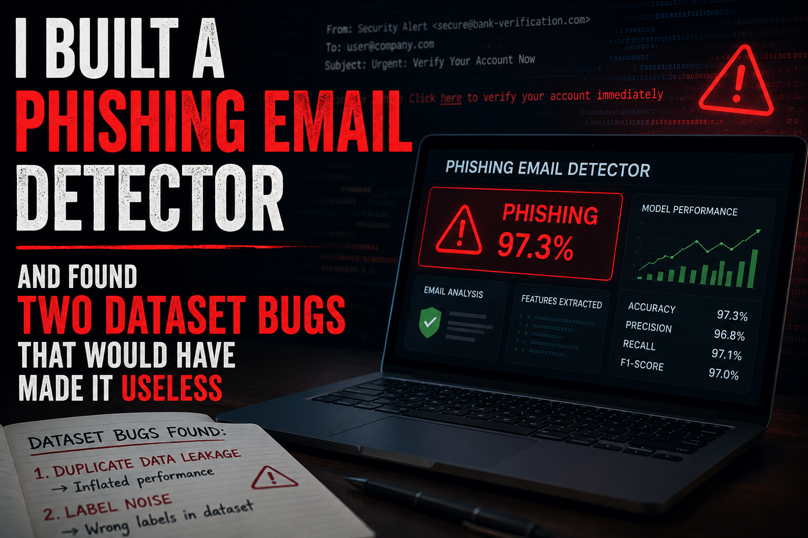
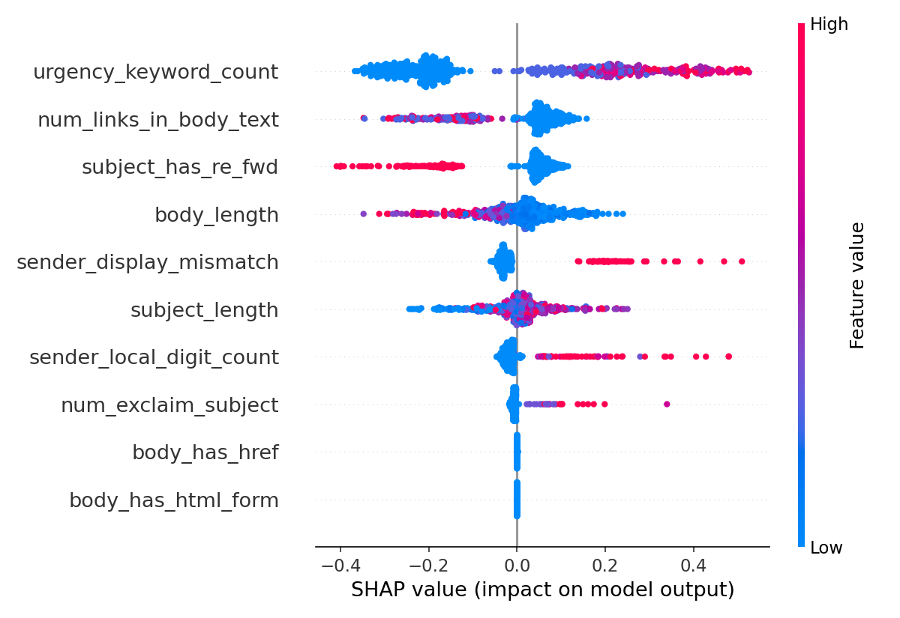

# Phishing Email Detection — Hybrid ML + Security Pipeline

A phishing email classifier built on engineered security/structural features, with SHAP explainability and a live demo. Built as a dual-purpose portfolio project spanning **cybersecurity** (feature engineering mimics manual SOC analyst triage) and **machine learning** (proper model comparison, leakage validation, explainability).

## Results

| Model | Precision | Recall | F1 | ROC-AUC |
|---|---|---|---|---|
| **Random Forest (best)** | 0.899 | 0.882 | **0.890** | 0.952 |
| XGBoost | 0.879 | 0.859 | 0.869 | 0.946 |
| Logistic Regression | 0.896 | 0.828 | 0.861 | 0.941 |

Evaluated on a held-out 20% test split (613 emails), stratified. Metrics are precision/recall/F1/ROC-AUC — not accuracy, since the classes are only near-balanced by chance and accuracy alone would hide a lazy model.

## The Real Story: Two Dataset Bugs Found and Fixed

This is the part worth reading if you're evaluating this project, not just the results table.

**1. Temporal leakage.** The source dataset (`Nazario_5.csv`, merging the Nazario phishing corpus with Enron as the "legit" class) has zero date overlap between classes: legit emails span 1992–2008, phishing emails span 2015–2022. Any feature correlated with email *era* — not phishing intent — would let a model cheat. `date` was dropped entirely, and every other feature was checked for correlation with the label before training (threshold: |r| > 0.9 flagged as suspicious).

**2. Inconsistent `urls` column.** The `urls` field is structured differently per class: legit rows contain a real list of URLs, phishing rows contain only a binary flag (`'0'`/`'1'`), not actual URLs. Recovering URLs from raw body text via regex only worked for 12% of phishing emails — too sparse to build a reliable domain-reputation feature on. URL-based security features (domain mismatch, IP-URL detection) were dropped rather than faked; a single class-consistent `num_links_in_body_text` count was kept instead.

Both issues are documented with the actual verification code in the notebook, not just asserted.

## Features Used

10 era-invariant, class-consistent features extracted from sender, subject, and body — no reliance on the broken `urls` column, no temporal metadata:

- `urgency_keyword_count` — strongest signal (SHAP importance ~0.24, correlation 0.59 with label)
- `sender_display_mismatch` — display name references a known brand but sender domain doesn't match (e.g. `"PayPal" <user@gmail.com>`)
- `sender_local_digit_count`, `subject_has_re_fwd`, `num_exclaim_subject`, `subject_length`, `body_length`, `num_links_in_body_text`, `body_has_form`, `body_has_href`

**Known dead weight:** `body_has_href` and `body_has_html_form` contribute almost nothing (SHAP importance ~0.0002 and ~0.00001). Kept in this version for transparency; candidates for removal in a v2.

## Explainability

Every prediction can be explained via SHAP — not just output as a black-box label. This is what turns a plain classifier into something closer to what an actual email security product (e.g. Proofpoint) surfaces to an analyst.



## Project Structure

```
├── phishing_detection.ipynb   # full pipeline: data investigation → features → training → SHAP
├── Nazario_5.csv               # dataset
├── best_model.pkl              # trained Random Forest model
├── app.py                      # Streamlit demo
├── requirements.txt
└── shap_summary.png
```

## Running It

```bash
pip install -r requirements.txt
jupyter notebook phishing_detection.ipynb   # full pipeline
streamlit run app.py                         # live demo
```

## Known Limitations (Read Before Asking "Is This Production-Ready?")

It isn't, and here's specifically why:

1. **No live URL reputation layer.** The dataset's URL data is unusable (see above). A production version needs a dataset with intact, class-consistent URLs plus a live PhishTank/domain-age check.
2. **Small dataset** — 3,065 rows. Enough to validate the pipeline and methodology, not enough to claim strong generalization to real-world traffic.
3. **Source-style imbalance risk.** Legit = corporate Enron emails, phishing = public phishing corpus. Vocabulary/formatting differences between the two *sources* — not just legit-vs-phishing intent — may still be partially learned even after removing date and URL leaks. Mitigated, not eliminated.
4. **Two dead features** left in for transparency rather than silently pruned.

## Dataset

Nazario Phishing Corpus (5) + TREC07/Enron, via [Kaggle](https://www.kaggle.com/datasets/rohansood98/phishing-email-dataset-nazario-5-and-trec07).
